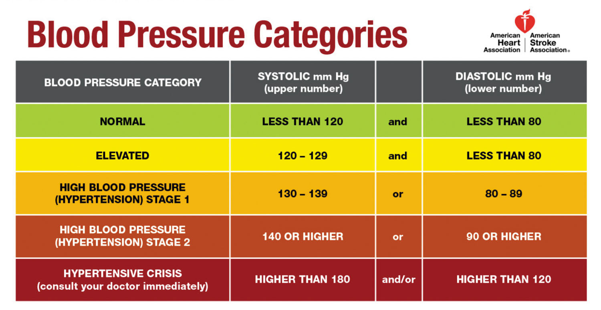

```{r setup, include=FALSE}
knitr::opts_chunk$set(echo = TRUE)
```

## Set Up Environment
```{r}
# Clear global environment
rm(list = ls())

# Set up libraries
# suppressMessage and suppressWarning functions used to make R-Markdown look better (not necessary)
suppressMessages(suppressWarnings(library(dplyr)))
suppressMessages(suppressWarnings(library(ggcorrplot)))
suppressMessages(suppressWarnings(library(factoextra)))
suppressMessages(suppressWarnings(library(glmnet)))
suppressMessages(suppressWarnings(library(tidyverse)))
suppressMessages(suppressWarnings(library(pls)))
suppressMessages(suppressWarnings(library(DAAG)))
suppressMessages(suppressWarnings(library(FNN)))
suppressMessages(suppressWarnings(library(class)))
suppressMessages(suppressWarnings(library(caret)))

# To create reproducible results
set.seed(123)

# Read in csv to framingham data set
framingham <- read.csv("data/frm.csv")
head(framingham) # Preview data frame
```

## Regression Problem: Predict BMI
### Set up for regression: modify the data set and set X and y
```{r}
# Create new data frame with only risk factor data (index 1-24)
# Don't include HDLC and LDLC (index 23, 24) data due to high number of NA's
fram_regression <- framingham %>% select(1:22)
# Look at modified data frame
head(fram_regression)

# Make new variables
#   - past_bmi = last measured bmi
#   - last_exam = time since last exam
fram_regression <- fram_regression %>%
  group_by(RANDID) %>% # Group by patient
  mutate(past_bmi = lag(BMI, default = NA), # Get BMI from last exam
         last_exam = TIME - lag(TIME, default = first(TIME))) %>% # Calculate number of days since last exam
  ungroup()

# Look at amount of NA values for each variable
nacols<-apply(fram_regression, 2, function(x) {sum(is.na(x))})
nacols

# Remove columns that are unnecessary and/or have lots of missing data
fram_regression <- fram_regression[, !(colnames(fram_regression) %in% c("X", "RANDID", "PERIOD", "GLUCOSE", "TIME", "BPMEDS", "CIGPDAY"))]

# Drop all rows with NA entries (will drop all period 1 data points and more)
fram_regression <- na.omit(fram_regression)

# Put data set into matrix form
data <- as.matrix(fram_regression)

# Set X -> a matrix made up of the risk factors being studied
X <- data[, -7]
head(X) # Preview matrix

# Set Y -> column vector of BMI values
y <- data[, 7]
head(y) # Preview matrix
```

### Lasso and Variable Selection
```{r}
# Set alpha to 1 for Lasso
alpha <- 1

# Use lasso to fit the data
fitL = glmnet(X,y, alpha = alpha)
# Plot variable coefficients vs L1 norm (the penalty applied for complexity)
plot(fitL, label=T)
# Plot variable coefficients vs log(lambda)
plot(fitL, xvar = "lambda", label=T)

# Print the variable names and corresponding numbers to better analyze graph
var_names <- colnames(X)
var_numbers <- 1:length(var_names)
print(data.frame(Variable_Number = var_numbers, Variable_Name = var_names))

# 10-fold cross-validation for lambda values
cvfitL = cv.glmnet(X,y, alpha = alpha)
# Plot MSE vs log(lambda) to find best lambda
plot(cvfitL)

# Lambda that minimizes the cross-validated error
cat("Lamda that minimizes error: ", cvfitL$lambda.min, "\n")
# Lambda that is one standard deviation away from minimum
cat("Lamda that gives best model: ", cvfitL$lambda.1se, "\n")

# Set lambda to value 1 standard deviation away from minimum
best_lambda <- cvfitL$lambda.1se
# Create the model with best lambda value
modelL <- glmnet(X, y, alpha = alpha, lambda = best_lambda)
# Print the coefficients for the LASSO model
coef(modelL)
```

### Evaluate LASSO model by doing 10-fold cross validation and finding the average error
```{r}
# Set the number of folds for cross-validation (e.g., 10 folds)
num_folds <- 10

# Create an index vector for cross-validation
folds <- sample(1:num_folds, size = nrow(X), replace = TRUE)

# Initialize vectors to store training and testing errors for each fold
train_errors <- numeric(num_folds)
test_errors <- numeric(num_folds)

# Perform k-fold cross-validation
for (fold in 1:num_folds) {
  # Split the data into training and testing sets
  train_data <- subset(X, folds != fold)
  test_data <- subset(X, folds == fold)
  train_labels <- y[folds != fold]
  test_labels <- y[folds == fold]
  
  # Train the LASSO model on the training data
  modelL_fold <- glmnet(train_data, train_labels, alpha = alpha, lambda = best_lambda)
  
  # Make predictions on the training set
  train_pred <- predict(modelL_fold, newx = train_data)
  
  # Make predictions on the testing set
  test_pred <- predict(modelL_fold, newx = test_data)  
  
  # Calculate training error (e.g., Mean Squared Error)
  train_errors[fold] <- mean((train_pred - train_labels)^2)
  
  # Calculate testing error (e.g., Mean Squared Error)
  test_errors[fold] <- mean((test_pred - test_labels)^2)
}

# Calculate average training and testing errors
avg_train_error <- mean(train_errors)
avg_test_error <- mean(test_errors)

# Print the results (Residual Standard Errors)
cat("Average LASSO Training Error:", avg_train_error, "\n")
cat("Average LASSO Testing Error:", avg_test_error, "\n")
```

### PCA and dimension reduction
```{r}
# Select variables based on LASSO (exclude variables whose coefficients went to 0)
new_fram <- fram_regression[, c("TOTCHOL", "AGE", "DIABP", "CURSMOKE", "DIABETES", "PREVCHD", "PREVMI", "past_bmi", "BMI")]

# X includes: TOTCHOL, AGE, DIABP, CURSMOKE, DIABETES, PREVCHD, PREVMI, past_bmi
new_X <- new_fram[, !(colnames(new_fram) %in% c("BMI"))]

# Normalize data for PCA
X_normalized <- scale(new_X)

# Compute correlation matrix
corr_matrix <- cor(X_normalized)
# Graph correlation matrix
ggcorrplot(corr_matrix)

# Apply PCA
data.pca <- princomp(corr_matrix)
# Look at potential dimension reduction by analyzing the cumulative proportion
summary(data.pca)

# Take a look into how the variables are represented in the components
# Components 1-5 explain 92% of variance in data
data.pca$loadings[, 1:5]

# Plot the eigenvalues/components against the number of dimensions
fviz_eig(data.pca, addlabels = TRUE)

# Graph of the variables and how they are related to the dimensions
#   - Direction implies variable correlation
#   - Magnitude implies variable's impact on component
fviz_pca_var(data.pca, col.var = "black")

# TODO: Cross-validation to pick num of components
# Set number of components
num_comps <- 5

# Extract the first 5 principal components
princ_comps <- predict(data.pca, newdata = X_normalized)[, 1:num_comps]
# Combine the principal components with other predictors
bmi_and_pca <- cbind(new_fram[, 9], princ_comps)

# Perform linear regression using the first 5 components
modelPCA <- lm(BMI ~ ., data = bmi_and_pca)
summary(modelPCA)
```

### Compare Models
```{r}
# Compare regression models
cat("RSE for LASSO:", avg_train_error, "\n")
cat("RSE for PCA Method:", summary(modelPCA)$sigma, "\n")
```


## Classification Problem: Predict blood pressure category
```{r, image, out.width="80%"} 
# Put blood pressure categories into R-markdown file

```

### Set up for classification: modify the data set, set X and y, and create loss function
```{r}
# Function to turn blood pressure numbers into categories
# Normal = 0; Elevated = 1; Stage 1 = 2; Stage 2 = 3; Crisis = 4
categorize <- function(SYSBP, DIABP) {
  if (is.na(SYSBP) | is.na(DIABP)){
    return(NA)
  } else if (SYSBP > 180 | DIABP > 120) {
    # Crisis
    return(5)
  } else if (SYSBP >= 140 | DIABP >= 90) { 
    # Stage 2
    return(4)
  } else if (SYSBP >= 130 | DIABP >= 80) {
    # Stage 1
    return(3)
  } else if (SYSBP >= 120){
    # Elevated
    return(2)
  } else {
    # Normal
    return(1)
  }
}

# Make new variable for blood pressure category
fram_classification <- framingham %>%
  rowwise() %>% # Iterate through each row
  mutate(BP_CAT = categorize(SYSBP, DIABP)) # Put each person into blood type categories

# Focus on SEX, BMI, AGE, DIABETES, HEARTRATE
wanted_vars <- c("SEX", "BMI", "AGE", "DIABETES", "HEARTRTE", "BP_CAT")
# Narrow down data set to desired variables
fram_classification <- fram_classification %>%
  select(all_of(wanted_vars))

# Look at number of NA's
nacols <- apply(fram_classification, 2, function(x) {sum(is.na(x))})
nacols

# Drop all rows with NA entries
fram_classification <- na.omit(fram_classification)

# Put data frame into matrix form
data <- as.matrix(fram_classification)

# X -> matrix with x variables
X <- data[, -6]
head(X)

# y -> column vector with blood pressure categories
y <- data[, 6]
head(y)

# Loss function that penalizes more for worse classifications
# Parameters: predicted and observed vectors of same length
# Returns mean of the squared difference (normalized)
loss <- function(predicted, observed) {
  # Get difference between predicted and observed classes
  diff <- predicted - observed
  
  # Calculate squared differences between predicted and observed classes
  # Gives higher punishments for classifications further away from observed
  squared_diff <- (diff)^2

  # Calculate mean squared difference
  mean_squared_diff <- mean(squared_diff)

  # Normalize the error by dividing by the greatest possible penalty
  normalized_error <- mean_squared_diff / 16
  
  # Return the normalized error
  return(normalized_error)
}
```

### Use KNN for classificaiton
```{r}
# Select index to split data into train and test data sets
validationIndex <- createDataPartition(fram_classification$BP_CAT, p=0.80, list=FALSE)

train <- data[validationIndex,] # 80% of data to training
test <- data[-validationIndex,] # Remaining 20% for test

# Scale train and test subsets
train_scale <- scale(as.matrix(train))
test_scale <- scale(test)

# Create X and y for training subset
Xtr_scale <- as.matrix(train_scale[,-6])
Ytr <- as.matrix(train[, 6])

# Create X and y for testing subset
Xte_scale <- as.matrix(test_scale[, -6])
Yte <- as.matrix(test[, 6])

# Create empty vectors to store k values and corresponding errors
k_values <- seq(5, 200, by = 5)
errors <- numeric(length(k_values))

# Loop through each k value
for (i in seq_along(k_values)) {
  k_value <- k_values[i]

  # Train the kNN model
  modelKNN <- knn(
    train = Xtr_scale,
    test = Xte_scale,
    cl = Ytr,
    k = k_value
  )
  
  # Get predicted vector
  predicted <- as.numeric(modelKNN)
  
  # Calculate error with custom loss function
  error <- loss(predicted, Yte)
  
  # Store the normalized error
  errors[i] <- error
}

# Find the minimum error value and its corresponding k value
error_KNN <- min(errors)
optimal_k <- k_values[which.min(errors)]

# Plot the relationship between k values and errors
plot(k_values, errors, type = "b", pch = 19,
     xlab = "k Value", ylab = "Error Rate", main = "kNN Error vs. k Value")

# Highlight the point with the minimum error
points(optimal_k, error_KNN, col = "red", pch = 16)
cat("Minimium error: ", error_KNN, "\n")
cat("k value with lowest error (optimal k): ", optimal_k, "\n")
```

### Use One-Hot Encoding for classification
```{r}
# Used the function from in class material
# Sets up one hot encoding by manipulating y
OneHot <- function(g, cls) {
	Y <- as.numeric(g==cls[1])
	for (b in cls[-1]){
		y <- as.numeric(g==b)
		Y <- cbind(Y,y)
	}
	return(Y)
}

# Put categories into an array
cls <- as.array(c(1, 2, 3, 4, 5))

# The correct classifications
g <- y

# Change Y into an array of 1's and 0's
Y <- OneHot(g, cls)
head(Y)

# Manipulate X to allow for matrix operations
X <- apply(X, 2, as.numeric)
head(X)

# Compute beta
XTX <- t(X) %*% X
XTY <- t(X) %*% Y
B <- solve(XTX,XTY)
B

# Compute Yhat
Yhat <- X%*%B

# Give the index of the greatest element in each vector
ghat <- apply(Yhat,1,which.max)

# Index corresponds with class, so predicted values are the index of the max value in each row of Y
predicted <- ghat

# Get errors calculated by custom loss function
error_OH <- loss(predicted, g)

cat("Error: ", error_OH, "\n")
```

### Compare Models
```{r}
# Compare classification models
cat("Error for KNN:", error_KNN, "\n")
cat("Error for One-Hot Encoding:", error_OH, "\n")
```

